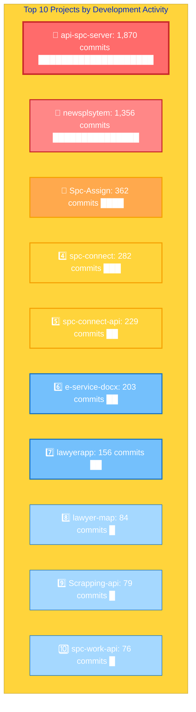

# SPC Project Portfolio - Master Index

**Last Updated:** January 21, 2026  
**Total Projects:** 37  
**Organization:** SPC (SITTIPRACHA CORPORATION)

## Overview

This workspace contains the complete technology stack for SPC's legal case management and debt collection platform. The system includes mobile applications, backend APIs, dashboards, OCR services, and integration tools that work together to manage legal workflows, document processing, and client services.

---

## 🔥 Top 10 Most Active Projects

These are the most critical and frequently updated projects in the SPC ecosystem:

| Rank | Project | Type | Key Features | Activity |
|------|---------|------|--------------|----------|
| 🥇 | [**api-spc-server**](https://github.com/SPCCX/api-spc-server) | Backend API | Central hub for all services, 100+ endpoints, OCR, AI, document processing | 🟢 Very High |
| 🥈 | [**CA_MobileApp**](https://github.com/SPCCX/CA_MobileApp) | Mobile App | Customer-facing app, case management, map integration, analytics | 🟢 Very High |
| 🥉 | [**spc-ocr**](https://github.com/SPCCX/spc-ocr) | Python API | Multi-engine OCR (Google Vision, Azure, Tesseract), document processing | 🟢 High |
| 4 | [**eService_mobile_New**](https://github.com/SPCCX/eService_mobile_New) | Mobile App | Next-gen e-service platform, enhanced features, modern architecture | 🟢 High |
| 5 | [**SPC-Notify**](https://github.com/SPCCX/SPC-Notify) | Backend API | Multi-channel notifications (Firebase, email, SMS, LINE) | 🟡 High |
| 6 | [**e-service-docx**](https://github.com/SPCCX/e-service-docx) | Backend API | Legal document generation, DOCX/PDF templates, batch processing | 🟡 High |
| 7 | [**Spc-Assign**](https://github.com/SPCCX/Spc-Assign) | Backend API | Intelligent case assignment, workload balancing, lawyer matching | 🟡 Medium |
| 8 | [**Dashboard_WSC**](https://github.com/SPCCX/Dashboard_WSC) | Frontend | Business analytics, KPI tracking, real-time metrics | 🟡 Medium |
| 9 | [**spc-work-api**](https://github.com/SPCCX/spc-work-api) | Backend API | Work management, time tracking, task assignment | 🟡 Medium |
| 10 | [**connect-erp**](https://github.com/SPCCX/connect-erp) | Backend API | ERP integration, data synchronization, automated workflows | 🟡 Medium |

**Activity Levels:**
- 🟢 **Very High** - Daily updates, critical to operations
- 🟡 **High** - Weekly updates, important features
- 🟠 **Medium** - Regular updates, stable features

### 📊 Activity by Commit Count

Based on actual git commit history (all-time):



**Commit Analysis:**
- 🔴 **1,000+ commits** - Extremely active development (api-spc-server, newsplsytem)
- 🟠 **200-500 commits** - High activity (Spc-Assign, spc-connect, spc-connect-api, e-service-docx)
- 🟡 **100-200 commits** - Medium activity (lawyerapp)
- 🔵 **<100 commits** - Stable/mature projects (lawyer-map, Scrapping-api, spc-work-api)

**Notable Projects (also active):**
- `spc-ocr`: 62 commits (OCR processing)
- `connect-erp`: 62 commits (ERP integration)
- `CA_MobileApp`: 60 commits (Customer mobile app)
- `spc-maill-management`: 33 commits (Mail management)

> **💡 Insight:** `api-spc-server` has 1,870 commits, making it the most actively developed project by far. This reflects its role as the central hub of the entire platform.

---

## Quick Reference Table

| Project | Type | Technology | Status | Purpose |
|---------|------|------------|--------|---------|
| [api-spc-server](https://github.com/SPCCX/api-spc-server) | Backend API | Node.js/Express | Production | Main API server with OCR, AI, document processing |
| [CA_MobileApp](https://github.com/SPCCX/CA_MobileApp) | Mobile App | Flutter | Production | Customer application for CA services |
| [SPC-Mobile-WORKS](https://github.com/SPCCX/SPC-Mobile-WORKS) | Mobile App | Flutter | Production | Mobile work management |
| [spc-ocr](https://github.com/SPCCX/spc-ocr) | Backend API | Python/FastAPI | Production | OCR processing service |
| [wcatapi](https://github.com/SPCCX/wcatapi) | Backend API | Python/FastAPI | Production | WCAT production line API |
| [Spc-Assign](https://github.com/SPCCX/Spc-Assign) | Backend API | Node.js/Express | Production | Assignment management system |
| [spc-work-api](https://github.com/SPCCX/spc-work-api) | Backend API | Node.js/Express | Production | Work management API |
| [Dashboard_WSC](https://github.com/SPCCX/Dashboard_WSC) | Frontend | Node.js/React | Production | WSC dashboard application |
| [Lawyer_Dashboard](https://github.com/SPCCX/Lawyer_Dashboard) | Frontend | Node.js | Production | Lawyer management dashboard |
| [eService_Lawyer_App](https://github.com/SPCCX/eService_Lawyer_App) | Mobile App | Flutter | Production | Lawyer e-service application |
| [eService_mobile_New](https://github.com/SPCCX/eService_mobile_New) | Mobile App | Flutter | Production | New e-service mobile app |
| [eservice_lawyer_app_new](https://github.com/SPCCX/eservice_lawyer_app_new) | Mobile App | Flutter | Production | Updated lawyer application |
| [sds_hrm_app](https://github.com/SPCCX/sds_hrm_app) | Mobile App | Flutter | Production | HRM mobile application |
| [wcat_productionline_app](https://github.com/SPCCX/wcat_productionline_app) | Mobile App | Flutter | Production | Production line management |
| [api_spc_ocr](https://github.com/SPCCX/api_spc_ocr) | Backend API | Python/FastAPI | Production | OCR API service |
| [connect-erp](https://github.com/SPCCX/connect-erp) | Backend API | Node.js/Express | Production | ERP system connector |
| [spc-connect](https://github.com/SPCCX/spc-connect) | Frontend | Node.js | Production | SPC connection service |
| [spc-connect-api](https://github.com/SPCCX/spc-connect-api) | Backend API | Node.js/Express | Production | SPC connect API backend |
| [e-service-docx](https://github.com/SPCCX/e-service-docx) | Backend API | Node.js/Express | Production | Document generation service |
| [Scrapping-api](https://github.com/SPCCX/Scrapping-api) | Backend API | Node.js/Express | Production | Web scraping service |
| [SPC-Notify](https://github.com/SPCCX/SPC-Notify) | Backend API | Node.js/Express | Production | Notification service |
| [Spc-realtime-api](https://github.com/SPCCX/Spc-realtime-api) | Backend API | Node.js/Express | Production | Real-time API service |
| [spc-realtime](https://github.com/SPCCX/spc-realtime) | Backend API | Node.js | Production | Real-time service v1 |
| [spc-realtime-v2](https://github.com/SPCCX/spc-realtime-v2) | Backend API | Node.js | Production | Real-time service v2 |
| [spc-dashbord](https://github.com/SPCCX/spc-dashbord) | Frontend | Node.js | Production | Main SPC dashboard |
| [lawyer-map](https://github.com/SPCCX/lawyer-map) | Frontend | Node.js | Production | Lawyer location mapping |
| [lawyerapp](https://github.com/SPCCX/lawyerapp) | Frontend | Node.js | Production | Lawyer web application |
| [newsplsytem](https://github.com/SPCCX/newsplsytem) | Frontend | Node.js | Production | News/content management |
| [Windy](https://github.com/SPCCX/Windy) | Backend API | Python | Production | Weather/wind data service |
| [DebtCollectorAPI](https://github.com/SPCCX/DebtCollectorAPI) | Backend API | .NET/C# | Production | Debt collection management |
| [DeptFlow](https://github.com/SPCCX/DeptFlow) | Backend | TBD | Production | Department workflow system |
| [Docker-ffmpeg](https://github.com/SPCCX/Docker-ffmpeg) | Service | Node.js/Docker | Production | FFmpeg media processing |
| [Weather_alert](https://github.com/SPCCX/Weather_alert) | Backend API | Node.js/Express | Production | Weather alert system |
| [E-Service-V4](https://github.com/SPCCX/E-Service-V4) | Frontend | Node.js | Production | E-Service version 4 |
| [api-assing-mail](https://github.com/SPCCX/api-assing-mail) | Backend API | Node.js/Express | Production | Email assignment API |
| [spc-maill-management](https://github.com/SPCCX/spc-maill-management) | Backend API | Node.js/Express | Production | Mail management system |
| [dev-documents](https://github.com/SPCCX/dev-documents) | Documentation | Markdown | Active | Development documentation |

---

## Project Categories

### 📱 Mobile Applications (7 Projects)

#### Customer & CA Applications
- **CA_MobileApp** - Customer application for CA (Collection Agency) services with map integration, file management, and analytics
- **SPC-Mobile-WORKS** - Mobile work management and tracking application

#### Lawyer Applications
- **eService_Lawyer_App** - Lawyer e-service application (current version)
- **eService_mobile_New** - New version of e-service mobile app with enhanced features
- **eservice_lawyer_app_new** - Updated lawyer application with modern architecture

#### Specialized Apps
- **sds_hrm_app** - Human Resource Management mobile application
- **wcat_productionline_app** - Production line management and quality control app

### 🔧 Backend APIs - Node.js/Express (24 Projects)

#### Core Services
- **api-spc-server** - Main API server handling legal case management, OCR, document processing, AI integration, and business logic
- **spc-work-api** - Work assignment and tracking API
- **Spc-Assign** - Assignment management and distribution system

#### Communication & Notifications
- **api-assing-mail** - Email assignment and processing API
- **spc-maill-management** - Mail tracking and organization system
- **SPC-Notify** - Multi-channel notification service (Firebase, email, SMS)
- **Spc-realtime-api** - Real-time communication API (WebSocket)
- **spc-realtime** - Real-time service v1
- **spc-realtime-v2** - Real-time service v2 with improved architecture

#### Integration & Connectivity
- **connect-erp** - ERP system integration and data synchronization
- **spc-connect-api** - Connection service API backend
- **Scrapping-api** - Web scraping and data extraction service

#### Document Processing
- **e-service-docx** - Document generation from templates (DOCX, PDF)
- **Docker-ffmpeg** - Media file processing and conversion

#### Dashboards & Reporting
- **Dashboard_WSC** - WSC (Wholesale Service Center) dashboard
- **Lawyer_Dashboard** - Lawyer performance and case management dashboard
- **spc-dashbord** - Main SPC business metrics dashboard

#### Specialized Services
- **lawyer-map** - Lawyer geolocation and mapping service
- **lawyerapp** - Lawyer web portal backend
- **newsplsytem** - News and content management system
- **Weather_alert** - Weather alert monitoring and notification
- **E-Service-V4** - E-Service platform version 4

### 🐍 Python Services (3 Projects)

#### OCR & Document Processing
- **spc-ocr** - Advanced OCR service using Google Cloud Vision, Azure Vision, and Tesseract
- **api_spc_ocr** - OCR API service with FastAPI
- **wcatapi** - WCAT production line API with database integration

#### Data Services
- **Windy** - Weather and wind data processing service

### 🔷 .NET Services (1 Project)

- **DebtCollectorAPI** - Debt collection management API built with C#/.NET

### 📊 Frontend Applications (6 Projects)

- **spc-connect** - SPC connection interface
- **Dashboard_WSC** - WSC analytics and reporting dashboard
- **Lawyer_Dashboard** - Lawyer management interface
- **spc-dashbord** - Main business dashboard
- **lawyer-map** - Interactive lawyer location map
- **lawyerapp** - Lawyer web application
- **newsplsytem** - Content management system

### 📚 Development Resources (1 Project)

- **dev-documents** - Development documentation, standards, and guides

---

## System Architecture

```mermaid
graph TB
    subgraph "Mobile Layer"
        CA[CA Mobile App]
        LAWYER[Lawyer Apps]
        HRM[HRM App]
        WORK[Work Mobile]
        WCAT_APP[WCAT App]
    end
    
    subgraph "Frontend Layer"
        DASH[Dashboards]
        MAP[Lawyer Map]
        NEWS[News System]
        CONNECT_UI[SPC Connect UI]
    end
    
    subgraph "API Gateway"
        MAIN_API[api-spc-server<br/>Main API]
    end
    
    subgraph "Backend Services"
        WORK_API[Work API]
        ASSIGN[Assignment API]
        MAIL[Mail Management]
        NOTIFY[Notification Service]
        REALTIME[Real-time Services]
        DOCX[Document Generation]
        SCRAPE[Scraping API]
    end
    
    subgraph "AI & Processing"
        OCR_PY[spc-ocr<br/>Python OCR]
        OCR_API[api_spc_ocr]
        FFMPEG[FFmpeg Service]
    end
    
    subgraph "Integration Layer"
        ERP[ERP Connector]
        CONNECT_API[SPC Connect API]
        WEATHER[Weather Alert]
    end
    
    subgraph "Specialized Systems"
        WCAT_API[WCAT API]
        DEBT[Debt Collector API]
    end
    
    subgraph "Data Layer"
        MYSQL[(MySQL)]
        MSSQL[(MSSQL)]
        REDIS[(Redis)]
        NAS[(NAS Storage)]
    end
    
    CA --> MAIN_API
    LAWYER --> MAIN_API
    HRM --> MAIN_API
    WORK --> WORK_API
    WCAT_APP --> WCAT_API
    
    DASH --> MAIN_API
    MAP --> MAIN_API
    NEWS --> MAIN_API
    CONNECT_UI --> CONNECT_API
    
    MAIN_API --> WORK_API
    MAIN_API --> ASSIGN
    MAIN_API --> MAIL
    MAIN_API --> NOTIFY
    MAIN_API --> REALTIME
    MAIN_API --> DOCX
    MAIN_API --> OCR_PY
    MAIN_API --> OCR_API
    MAIN_API --> FFMPEG
    
    MAIN_API --> ERP
    MAIN_API --> WEATHER
    
    WORK_API --> MYSQL
    MAIN_API --> MYSQL
    MAIN_API --> MSSQL
    MAIN_API --> REDIS
    MAIN_API --> NAS
    
    OCR_PY --> NAS
    WCAT_API --> MSSQL
    DEBT --> MSSQL
```



---

## Technology Stack Summary

### Backend
- **Node.js/Express** - 24 projects (primary backend framework)
- **Python/FastAPI** - 3 projects (OCR and data processing)
- **.NET/C#** - 1 project (debt collection)

### Frontend
- **React/Vue.js** - Dashboard applications
- **HTML/CSS/JavaScript** - Web applications

### Mobile
- **Flutter/Dart** - 7 projects (all mobile applications)

### Databases
- **MySQL** - Primary database for case management
- **MSSQL** - Secondary database for specific modules
- **Redis** - Caching and session management

### Cloud Services
- **Google Cloud Vision** - OCR processing
- **Azure Vision** - OCR processing
- **Firebase** - Push notifications
- **OpenAI** - AI-powered features

### Infrastructure
- **Docker** - Containerization
- **NAS (Synology)** - File storage
- **WebDAV** - File access protocol

---

## Getting Started

### Prerequisites
- **Node.js** 14+ (for Node.js projects)
- **Python** 3.8+ (for Python projects)
- **.NET** 6.0+ (for .NET projects)
- **Flutter** 3.5+ (for mobile projects)
- **MySQL** 8.0+
- **Redis** 6.0+

### Environment Setup

Each project contains a `DOCUMENTATION.md` file with detailed setup instructions. General steps:

1. **Clone the repository**
   ```bash
   cd /Users/adabrain/Github/spc
   ```

2. **Navigate to specific project**
   ```bash
   cd <project-name>
   ```

3. **Install dependencies**
   - Node.js: `npm install`
   - Python: `pip install -r requirements.txt`
   - Flutter: `flutter pub get`

4. **Configure environment**
   - Copy `.env.example` to `.env`
   - Update database credentials and API keys

5. **Run the project**
   - Node.js: `npm run dev` or `npm start`
   - Python: `uvicorn main:app --reload`
   - Flutter: `flutter run`

---

## Project Interconnections

### Core Dependencies
- **api-spc-server** is the central hub that most other services depend on
- **spc-ocr** and **api_spc_ocr** provide OCR services to api-spc-server
- **SPC-Notify** handles notifications for multiple services
- **spc-realtime-api** provides real-time updates to dashboards and mobile apps

### Data Flow
1. Mobile apps and dashboards → **api-spc-server** → Database
2. Document uploads → **api-spc-server** → **spc-ocr** → Processed data
3. Work assignments → **Spc-Assign** → **SPC-Notify** → Users
4. Email processing → **api-assing-mail** → **spc-maill-management**
5. ERP data → **connect-erp** → **api-spc-server**

---

## Documentation Links

Each project has detailed documentation in its respective `DOCUMENTATION.md` file:

### Mobile Applications
- [CA_MobileApp/DOCUMENTATION.md](file:///Users/adabrain/Github/spc/CA_MobileApp/DOCUMENTATION.md)
- [SPC-Mobile-WORKS/DOCUMENTATION.md](file:///Users/adabrain/Github/spc/SPC-Mobile-WORKS/DOCUMENTATION.md)
- [eService_Lawyer_App/DOCUMENTATION.md](file:///Users/adabrain/Github/spc/eService_Lawyer_App/DOCUMENTATION.md)
- [eService_mobile_New/DOCUMENTATION.md](file:///Users/adabrain/Github/spc/eService_mobile_New/DOCUMENTATION.md)
- [eservice_lawyer_app_new/DOCUMENTATION.md](file:///Users/adabrain/Github/spc/eservice_lawyer_app_new/DOCUMENTATION.md)
- [sds_hrm_app/DOCUMENTATION.md](file:///Users/adabrain/Github/spc/sds_hrm_app/DOCUMENTATION.md)
- [wcat_productionline_app/DOCUMENTATION.md](file:///Users/adabrain/Github/spc/wcat_productionline_app/DOCUMENTATION.md)

### Backend APIs
- [api-spc-server/DOCUMENTATION.md](file:///Users/adabrain/Github/spc/api-spc-server/DOCUMENTATION.md)
- [spc-work-api/DOCUMENTATION.md](file:///Users/adabrain/Github/spc/spc-work-api/DOCUMENTATION.md)
- [Spc-Assign/DOCUMENTATION.md](file:///Users/adabrain/Github/spc/Spc-Assign/DOCUMENTATION.md)
- [And 21 more...](#backend-apis---nodejsexpress-24-projects)

### Python Services
- [spc-ocr/DOCUMENTATION.md](file:///Users/adabrain/Github/spc/spc-ocr/DOCUMENTATION.md)
- [api_spc_ocr/DOCUMENTATION.md](file:///Users/adabrain/Github/spc/api_spc_ocr/DOCUMENTATION.md)
- [wcatapi/DOCUMENTATION.md](file:///Users/adabrain/Github/spc/wcatapi/DOCUMENTATION.md)
- [Windy/DOCUMENTATION.md](file:///Users/adabrain/Github/spc/Windy/DOCUMENTATION.md)

---

## Support & Maintenance

### Active Development
All projects are actively maintained and in production use.

### Version Control
Each project maintains its own version history via Git.

### Issue Tracking
Issues and feature requests are tracked per project.

---

## License

Proprietary - SPC (Siam Premier Collection)  
All rights reserved.
